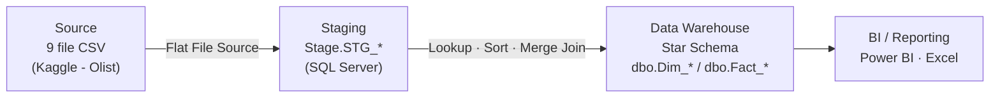

<div align="center">

# Olist E-Commerce Data Warehouse

### Kho dữ liệu phân tích thương mại điện tử — Kimball Star Schema · SSIS · SQL Server

[](https://www.microsoft.com/sql-server)
[](https://learn.microsoft.com/en-us/sql/integration-services/)
[](#-mô-hình-dữ-liệu)
[](LICENSE)

</div>

---

## Tổng quan

Olist là marketplace kết nối hàng nghìn seller độc lập với khách hàng trên khắp Brazil. Dữ liệu vận hành — đơn hàng, thanh toán, đánh giá, giao nhận — nằm rải rác ở nhiều hệ thống, khiến việc trả lời nhanh các câu hỏi tổng hợp (ví dụ: _"seller nào vừa có doanh thu cao vừa giao hàng đúng hạn?"_) đòi hỏi join tay hàng chục bảng thô.

Dự án xây dựng một **kho dữ liệu (Data Warehouse)** theo mô hình **Star Schema** chuẩn Kimball, tự động hóa toàn bộ pipeline ETL bằng **SQL Server Integration Services (SSIS)**, biến 9 file CSV rời rạc (~1.5 triệu dòng) thành một mô hình dữ liệu hợp nhất — sẵn sàng phục vụ phân tích doanh thu, hiệu quả vận hành, mức độ hài lòng khách hàng và hiệu suất người bán.

## Mục lục

- [Bài toán nghiệp vụ](#-bài-toán-nghiệp-vụ)
- [Kiến trúc hệ thống](#-kiến-trúc-hệ-thống)
- [Mô hình dữ liệu (ERD)](#-mô-hình-dữ-liệu)
- [Công nghệ sử dụng](#-công-nghệ-sử-dụng)
- [Pipeline ETL](#-pipeline-etl)
- [Cấu trúc thư mục](#-cấu-trúc-thư-mục)
- [Hướng dẫn cài đặt](#-hướng-dẫn-cài-đặt--chạy-thử)
- [Nhóm thực hiện](#-nhóm-thực-hiện)

---

## Bài toán nghiệp vụ

| Nhóm stakeholder | Câu hỏi kinh doanh cần trả lời                                       |
| ---------------- | -------------------------------------------------------------------- |
| Ban Giám đốc     | Doanh thu, xu hướng tăng trưởng theo tháng/quý/năm                   |
| Quản lý Vận hành | Tỷ lệ giao hàng đúng hạn, thời gian xử lý đơn trung bình             |
| Customer Success | Điểm hài lòng (CSAT), mối liên hệ giữa delivery time và review score |
| Seller Relations | Top seller theo doanh thu, rating trung bình, hiệu quả giao hàng     |
| Marketing        | Phương thức thanh toán phổ biến, phân khúc theo địa lý               |

**KPI cốt lõi:** Total Revenue · AOV · On-time Delivery Rate · CSAT · Repeat Customer Rate

## Kiến trúc hệ thống

Pipeline được tổ chức theo 3 lớp, tách biệt rõ trách nhiệm để dễ kiểm soát chất lượng và mở rộng:



- **Source Layer** — 9 file CSV thô từ [Brazilian E-Commerce Public Dataset by Olist](https://www.kaggle.com/datasets/olistbr/brazilian-ecommerce)
- **Staging Layer** — vùng đệm trung gian, đồng nhất kiểu dữ liệu trước khi biến đổi
- **Data Warehouse Layer** — mô hình Star Schema với 6 Dimension + 4 Fact table

## Mô hình dữ liệu

```mermaid
erDiagram
    DIM_DATE ||--o{ FACT_SALES : "purchase_date"
    DIM_DATE ||--o{ FACT_PAYMENT : "payment_date"
    DIM_DATE ||--o{ FACT_REVIEW : "review_date"
    DIM_DATE ||--o{ FACT_DELIVERY : "purchase_date"
    DIM_DATE ||--o{ FACT_DELIVERY : "approved_date"
    DIM_DATE ||--o{ FACT_DELIVERY : "carrier_date"
    DIM_DATE ||--o{ FACT_DELIVERY : "delivery_date"
    DIM_DATE ||--o{ FACT_DELIVERY : "estimated_date"
    DIM_CUSTOMER ||--o{ FACT_SALES : "purchased_by"
    DIM_CUSTOMER ||--o{ FACT_PAYMENT : "paid_by"
    DIM_CUSTOMER ||--o{ FACT_REVIEW : "reviewed_by"
    DIM_CUSTOMER ||--o{ FACT_DELIVERY : "shipped_to"
    DIM_PRODUCT ||--o{ FACT_SALES : "product_sold"
    DIM_SELLER ||--o{ FACT_SALES : "sold_by"
    DIM_PAYMENT_TYPE ||--o{ FACT_PAYMENT : "paid_via"
    DIM_ORDER_STATUS ||--o{ FACT_DELIVERY : "current_status"

    DIM_DATE {
        int date_key PK
        date full_date
        varchar month_name
        tinyint quarter
        smallint year
        char year_month
        char year_quarter
        varchar scd_type "SCD Type 0 - role-playing dimension"
    }
    DIM_CUSTOMER {
        int customer_key PK
        varchar customer_id
        varchar customer_state
        date effective_date
        date expiration_date
        bit is_current
        varchar scd_type "SCD Type 2"
    }
    DIM_PRODUCT {
        int product_key PK
        varchar product_category_en
        varchar scd_type "SCD Type 1"
    }
    DIM_SELLER {
        int seller_key PK
        varchar seller_state
        varchar scd_type "SCD Type 1"
    }
    DIM_PAYMENT_TYPE {
        int payment_type_key PK
        varchar payment_type
        varchar scd_type "SCD Type 0"
    }
    DIM_ORDER_STATUS {
        int status_key PK
        varchar status_code
        varchar scd_type "SCD Type 0"
    }
    FACT_SALES {
        bigint sales_key PK
        varchar order_id
        decimal price
        decimal total_value
        varchar grain "1 dong = 1 order_item"
    }
    FACT_PAYMENT {
        bigint payment_key PK
        decimal payment_value
        int payment_installments
        varchar grain "1 dong = 1 lan thanh toan"
    }
    FACT_REVIEW {
        bigint review_key PK
        decimal review_score
        bit has_title
        bit has_message
        varchar grain "1 dong = 1 review"
    }
    FACT_DELIVERY {
        bigint delivery_key PK
        decimal delivery_days
        bit is_on_time
        varchar grain "1 dong = 1 order_id"
    }
```

<details>
<summary><b>Xem ERD đầy đủ (Mermaid — click để mở rộng)</b></summary>



Source đầy đủ: [`olist_erd.mmd`](olist_erd.mmd) — mở trực tiếp bằng [mermaid.live](https://mermaid.live) hoặc extension Mermaid trong VS Code.

</details>

| Bảng                                               | Loại      | Grain                     | SCD Type                         |
| -------------------------------------------------- | --------- | ------------------------- | -------------------------------- |
| `Fact_Sales`                                       | Fact      | 1 dòng = 1 order item     | —                                |
| `Fact_Payment`                                     | Fact      | 1 dòng = 1 lần thanh toán | —                                |
| `Fact_Review`                                      | Fact      | 1 dòng = 1 đánh giá       | —                                |
| `Fact_Delivery`                                    | Fact      | 1 dòng = 1 đơn hàng       | —                                |
| `Dim_Customer`                                     | Dimension | —                         | Type 2 (theo dõi lịch sử địa lý) |
| `Dim_Product`                                      | Dimension | —                         | Type 1                           |
| `Dim_Seller`                                       | Dimension | —                         | Type 1                           |
| `Dim_Date`, `Dim_Payment_Type`, `Dim_Order_Status` | Dimension | —                         | Type 0                           |

## Công nghệ sử dụng

| Thành phần    | Công cụ                                                                               |
| ------------- | ------------------------------------------------------------------------------------- |
| ETL           | SQL Server Integration Services (SSIS) — Data Flow, Lookup, Merge Join, SCD Transform |
| Database      | SQL Server / SQL Server Management Studio (SSMS)                                      |
| Data Modeling | Kimball Star Schema, Slowly Changing Dimension (Type 0/1/2)                           |
| IDE           | Visual Studio 2022 + SQL Server Data Tools (SSDT)                                     |
| Trực quan hóa | Power BI / Excel                                                                      |

## Pipeline ETL

Control Flow gồm **17 Data Flow Task**, tổ chức theo 3 nhóm chạy tuần tự có kiểm soát phụ thuộc (Precedence Constraint):

1. **Staging** (7 task) — đọc CSV → ghi vào `Stage.STG_*`, chạy song song vì độc lập nguồn
2. **Load Dimension** (6 task) — Lookup "No Match" để chỉ insert bản ghi mới; riêng `Dim_Customer` áp dụng SCD Type 2 đầy đủ (New/Historical/Changing Attribute)
3. **Load Fact** (4 task) — tra cứu surrogate key từ toàn bộ Dimension liên quan trước khi nạp, đảm bảo toàn vẹn tham chiếu

**Tối ưu hiệu năng:** Fast Load (`TABLOCK, CHECK_CONSTRAINTS`) khi ghi dữ liệu, giới hạn tập Lookup reference (chỉ tra `is_current = 1` ở `Dim_Customer`) để giảm thời gian nạp cache.

**Vận hành:** Logging Provider (Text file) ghi lại `OnError`, `OnTaskFailed`, `PreExecute`, `PostExecute` — hỗ trợ audit và debug khi pipeline chạy thật.

## Cấu trúc thư mục

```
olist-data-warehouse-ssis/
├── Data Warehouse/
│   ├── DWH_SSIS_GR4.slnx        # Solution file (Visual Studio)
│   ├── DWH_SSIS_GR4.dtproj      # SSIS project file
│   ├── Package.dtsx             # Package ETL chính (Control Flow + Data Flow)
│   └── Project.params
├── sql/
│   ├── DDL_Script.sql           # Script tạo toàn bộ Dim/Fact table
│   └── Staging.sql              # Script tạo bảng Staging
├── olist_erd.mmd                # ERD (Mermaid — tự render trên GitHub)
├── screenshots/                 # Ảnh chụp Control Flow / Data Flow / kết quả
├── .gitignore
├── LICENSE
└── README.md
```

## Hướng dẫn cài đặt & chạy thử

**Yêu cầu môi trường:** Windows, SQL Server 2019+, Visual Studio 2022 kèm extension **SQL Server Integration Services Projects**.

```bash
# 1. Clone repo
git clone https://github.com/User-Name-netizen/olist-data-warehouse-ssis.git

# 2. Tải dataset gốc
# https://www.kaggle.com/datasets/olistbr/brazilian-ecommerce
# → giải nén vào thư mục archive/ tại thư mục gốc project

# 3. Tạo schema & bảng
# Mở SSMS, chạy lần lượt:
#   sql/Staging.sql
#   sql/DDL_Script.sql

# 4. Mở & chạy pipeline
# Mở "Data Warehouse/DWH_SSIS_GR4.slnx" bằng Visual Studio 2022
# Cập nhật lại Connection Manager trỏ đúng SQL Server instance của bạn
# Nhấn F5 để chạy toàn bộ Package.dtsx
```

## Kết quả

- Hợp nhất 9 nguồn dữ liệu rời rạc (~1.5 triệu dòng) thành mô hình Star Schema thống nhất
- Tự động hóa toàn bộ pipeline ETL, có kiểm soát phụ thuộc (precedence constraint), logging và khử trùng lặp
- Sẵn sàng phục vụ truy vấn phân tích đa chiều: doanh thu, vận hành giao hàng, mức độ hài lòng khách hàng, hiệu suất seller

## License

Phát hành theo giấy phép [MIT](LICENSE) — dùng cho mục đích học tập và tham khảo.
